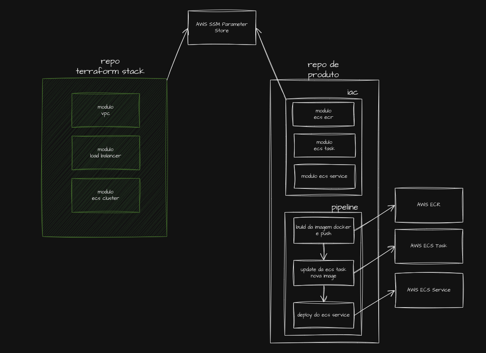

# Projeto Final Terraform intensivo repo de produto

Aplicação desenvolvida em node.js apenas para demonstração de caso de uso de um repo de produto.

Neste repo de produto, temos os módulos terraform responsaveis por:

* ECR - Elastic Container Registry - Armazenar a imagem da aplicação
* ECS Service - criar o service do ecs
* ECS Task - criar a task do service




Build do node.js

```sh
# Faz o build da imagem
$ docker build -t pgtest .
# Executa o container
$ docker run --env-file=.env -p 3001:3001 --network pgadmin_default pgtest
```

Ao acessar: http://localhost:3001

Se obtem o retorno abaixo em caso de sucesso:

#### Connected to database: postgres on server: 10.0.0.2 at Tue Aug 13 2024 19:52:42 GMT+0000 (Coordinated Universal Time)
